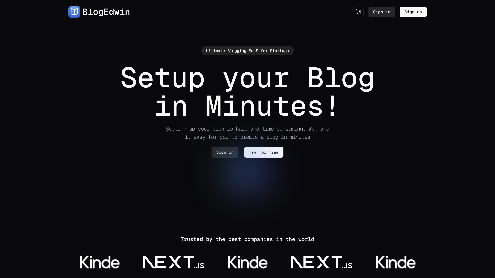

# BlogEdwin

<p><samp>BlogEdwin modern blog application built with Next.js, using Kinde, Prisma, and Supabase for seamless data management and RichText editor for enhanced content creation. It offers a dynamic and user-friendly interface for writing, editing, and publishing articles.</samp></p>

#
### Author
Edwin | [@edwiee](https://github.com/edwiee)

#
### Tech Stack
[NextJS](https://nextjs.org) &nbsp; [Kinde](https://kinde.com) &nbsp; [Prisma](https://www.prisma.io) &nbsp; [Tailwind CSS](https://tailwindcss.com)


#


## Setup locally

Make sure to install the dependencies:

```bash
# yarn
yarn install

# npm
npm install

# pnpm
pnpm install --shamefully-hoist
```

## Development Server

Start the development server on http://localhost:3000

```bash
npm run dev
```

## Production

Build the application for production:

```bash
npm run build
```

Locally preview production build:

```bash
npm run preview
```

----
<p align = "center"><samp>Made with ❤️ - <a href = "https://github.com/edwiee">edwiee</a></samp></p>
